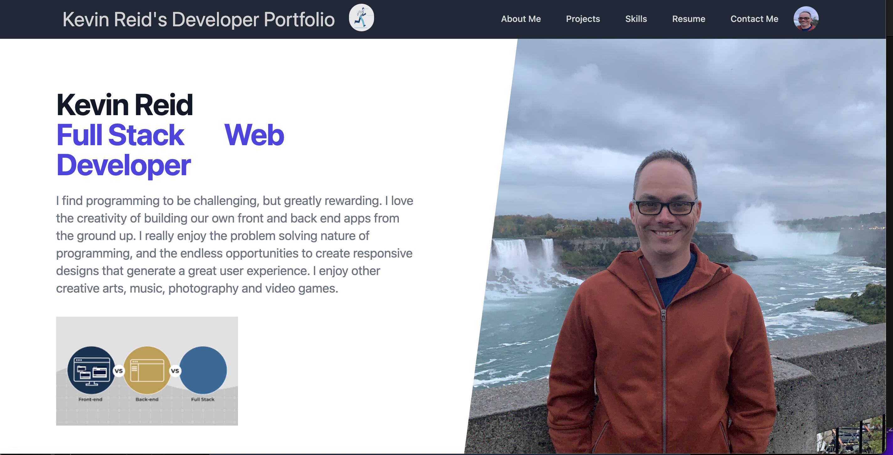

### Developer Portfolio 
### User Story

As a Web Developer, I want a portfolio that will showcase my skills, not only those I have learned in the course, but also ones I was able to pick up on my own. I want a website that features the following: An About me page, a Projects page, a Skills Page, and a contact me form. This should be a Single web page application rendering componants as they are requested.

### Features
This web application uses React.js and Tailwind to create a Single Web Page Application
The web page features a navigation bar which will take input from the user and render the requested componants
This page has an animation library used in the navigation bar.
This page features a project section with modal to see more information about the clicked project.
This page has a contact form with regex validation for email.

### Badges

## Table of Contents

- [installation](#installation)
- [contribution guidelines](#contribution)
- [Test Instructions](#testing)
- [License](#license)
- [Questions](#questions)

### Installation
1. Please clone the github repo here :
https://github.com/Vinyldude8896/portfolio_react
2. Run npm install to install the dependecies.
3. Then at the root folder, run npm start
4. In your browser navigate to:
http://localhost:3000/#home

You can also view the live page here:  
https://vinyldude8896.github.io/portfolio_react/

### Contribution Guidelines
Current contributers:
Kevin Reid : https://github.com/Vinyldude8896  

### Testing
To test this app: 
1. Clone the repo here : https://github.com/Vinyldude8896/portfolio_react.  
2. Install depenencies using npm install.  
3. from the root folder run npm start  
4. Browser should open to this page: http://localhost:3000/#home  
5. Try nagigation around the site  
6. Test out the form in the contact Me section  
7. Also test out the live Github page here: https://vinyldude8896.github.io/portfolio_react/

### Questions
    email address : kevinnivek@me.com
    - additional instructions 
    I can be contacted by phone as well, but prefer email contact first.
### Images

